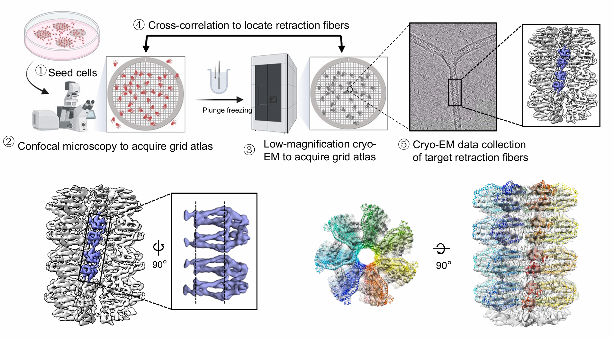

<strong>Our Research</strong>

  

    Our laboratory specializes in cryo-EM-based cellular structural biology, with a primary focus on developing cryo-EM methodologies and applying them to study macromolecular assemblies.
  

  

    <strong>1.</strong> We are interested in exploring the molecular mechanisms underlying <strong>membrane curvature maintenance</strong> by integrating in situ cryo-EM and cell biology techniques. Recently, we discovered that tetraspanin-7 induces and stabilizes tubular membrane structures by polymerizing into a spiral higher-order assembly—a structural framework we termed the “Transmembrane Skeleton” (bioRxiv, 2024).
  

  <strong>2.</strong> We are interested in <strong>cryo-EM methodology development</strong>. Our lab pioneers innovative cryo-EM specimen preparation techniques by integrating functionalized nanomaterials—such as graphene and carbon nanotubes—to overcome key limitations in cryo-EM technique (Nat Methods, 2023; JACS, 2019, 2023; PNAS, 2024; Nat Commun, 2021, 2022, 2024; etc). We are also exploring <strong>AI-powered structural data analysis and mining approaches</strong>. These technologies will be further developed and applied in cryo-EM structural studies.

